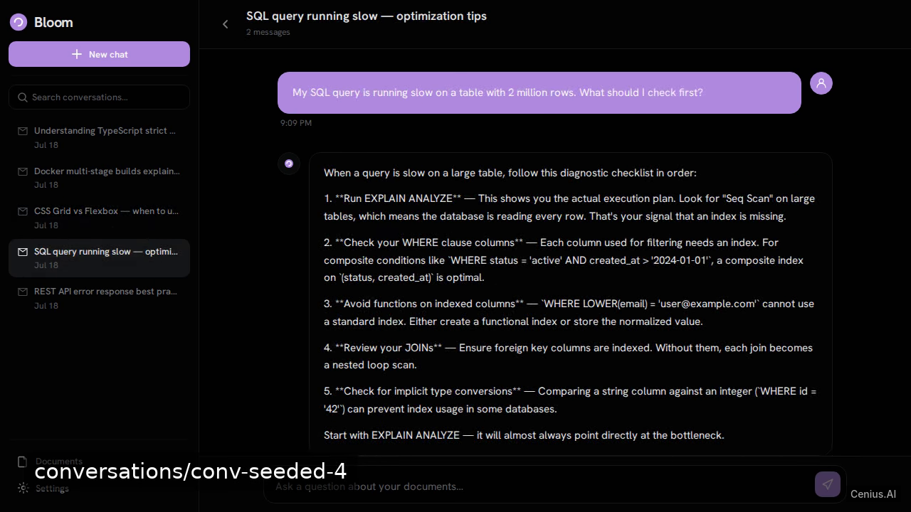
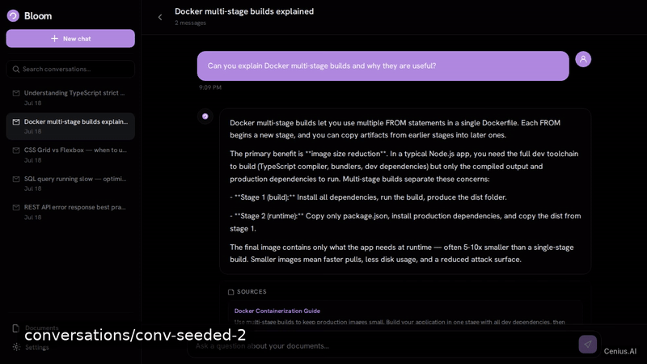
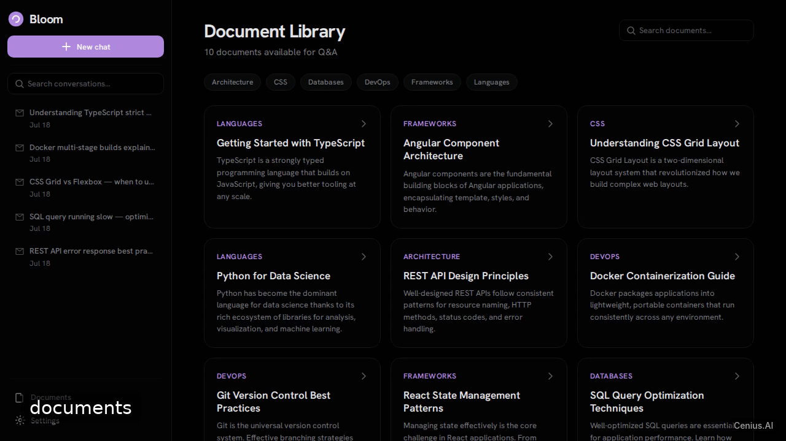

# Bloom — Docs Q&A AI Chatbot — Full-stack app retrieval-augmented search app reference implementation

We'll build a browser-based, mock-powered RAG chatbot named Bloom that lets users ask questions about pre‑loaded documents and receive answers with simulated source citations. That's **Bloom — Docs Q&A AI Chatbot** — a Apache-2.0-licensed, open-source retrieval-augmented search app in Full-stack app you can self-host and modify freely. Fork Bloom — Docs Q&A AI Chatbot, run it, or [remix it on cenius.ai](https://cenius.ai/marketplace/p/bloom-docs-q-a-ai-chatbot?ref=gh&utm_campaign=bloom-docs-q-a-ai-chatbot-webapp) for a custom Bloom — Docs Q&A AI Chatbot build with full rebrand rights.


[](LICENSE)  [](https://cenius.ai)

[](https://cenius.ai/marketplace/p/bloom-docs-q-a-ai-chatbot?ref=gh&utm_campaign=bloom-docs-q-a-ai-chatbot-webapp)

> **▶ [Open & edit in cenius.ai](https://cenius.ai/marketplace/p/bloom-docs-q-a-ai-chatbot?ref=gh&utm_campaign=bloom-docs-q-a-ai-chatbot-webapp)** — one click to an editable workspace: describe changes in plain English, get an instant preview, one-click deploy and host. Modifications made on the platform come with full rebrand & relicense rights.

_Local clone? See [Quick start](#quick-start) below. cenius.ai is the zero-setup path._

## Demo





📽 **[Demo video on cenius.ai](https://cenius.ai/marketplace/p/bloom-docs-q-a-ai-chatbot?ref=gh&utm_campaign=bloom-docs-q-a-ai-chatbot-webapp)** — the complete run-through · [MP4](.github/media/demo.mp4)

## Screenshots

  

## Architecture

`./install.sh` gets you from a fresh clone to a running instance with sample data in a single step. The Full-stack app codebase (85 files) is self-contained — no external services needed to evaluate it. Top-level layout: `src/`. See [`INSTALL.md`](INSTALL.md) for complete setup instructions.

## Features

- Start New Conversation
- Ask a Question
- Conversation History
- Resume Conversation
- Delete Conversation
- Light/Dark Theme Toggle
- Document Library
- Search Conversations
- Copy Message to Clipboard

## Quick start

```bash
./install.sh   # installs dependencies + seeds demo data
```

See [`INSTALL.md`](INSTALL.md) for full setup and usage instructions.

## Usage guide

Bloom is a single-page application that runs in the browser. Once the development server is running, open `http://localhost:4200` in a web browser.

### Main Screens

The application includes the following pages, accessible via the sidebar navigation:

- **Conversations** (`/conversations`): View a list of past conversation threads. Click on a conversation to see its detail.
- **Conversation Detail** (`/conversations/:id`): Engage in a Q&A chat. Type questions in the input box to get AI-generated answers based on your documents. The chat history is displayed using `chat-message` components.
- **Documents** (`/documents`): Browse uploaded documents. Each document can be clicked to view details.
- **Document Detail** (`/documents/:id`): View information about a specific document, such as its name, size, and upload date.
- **Settings** (`/settings`): Toggle between light and dark theme. Other appearance or application settings may be available.

### Theme Toggle

Use the theme toggle in the sidebar or settings page to switch between light and dark mode. The application defaults to the system preference.

### Chat Interaction

In a conversation:

1. Type a question into the chat input at the bottom of the screen.
2. Press Enter or click the send button.
3. The AI assistant will process your query using the document knowledge base and display a response.
4. You can continue the conversation with follow-up questions.

### Demo Data

The application includes seeded demo data for conversations and documents to illustrate functionality without requiring an external backend.

_Full guide: [`USAGE.md`](USAGE.md)_

## FAQ

### What's the quickest way to self-host Bloom — Docs Q&A AI Chatbot?

`git clone` + `./install.sh` gets you a running instance — the install script provisions dependencies and demo data. Full steps live in [`INSTALL.md`](INSTALL.md); nothing external is needed to try it.

### Is it OK to ship Bloom — Docs Q&A AI Chatbot as part of a product?

It is. Apache-2.0 licensing means you can build a product on it, sell it, or use it inside a company with no fees. Details: [LICENSE](LICENSE).

### Can non-developers customise Bloom — Docs Q&A AI Chatbot?

The easiest route: [visit the project on cenius.ai](https://cenius.ai/marketplace/p/bloom-docs-q-a-ai-chatbot?ref=gh&utm_campaign=bloom-docs-q-a-ai-chatbot-webapp), tell the platform what to change, and collect the updated build. No source-editing needed.

### What is Bloom — Docs Q&A AI Chatbot built with?

Bloom — Docs Q&A AI Chatbot is a Full-stack app application — and this repository holds the complete, runnable source, not a stripped-down sample. Highlights include start New Conversation.

### How do I make Bloom — Docs Q&A AI Chatbot my own brand?

Yes. You can edit the source directly under the MIT license, or [remix it on cenius.ai](https://cenius.ai/marketplace/p/bloom-docs-q-a-ai-chatbot?ref=gh&utm_campaign=bloom-docs-q-a-ai-chatbot-webapp) — the platform route grants full rebrand and relicense rights over your derivative.

## License & rebranding

Released under the [Apache License 2.0](LICENSE) (© 2026 Cenius AI) — free for personal and commercial use. The Cenius name/logo are trademarks (see NOTICE).

**Need a customized version?** [Remix this app on cenius.ai](https://cenius.ai/marketplace/p/bloom-docs-q-a-ai-chatbot?ref=gh&utm_campaign=bloom-docs-q-a-ai-chatbot-webapp) — modifications made on the platform come with **full rebrand & relicense rights** over your derivative.

## Built with cenius.ai

This entire application — code, design, seeded demo data — was generated on **[cenius.ai](https://cenius.ai)** from a plain-English description.

- 🚀 [Build your own app on cenius.ai](https://cenius.ai)
- 🎛️ [Remix Bloom — Docs Q&A AI Chatbot on the marketplace](https://cenius.ai/marketplace/p/bloom-docs-q-a-ai-chatbot?ref=gh&utm_campaign=bloom-docs-q-a-ai-chatbot-webapp) — open it in a workspace, prompt for changes, and ship your own version.

More open-source apps: [the Cenius-ai catalog](https://github.com/Cenius-ai) · [showcase index](https://github.com/Cenius-ai/showcase)
